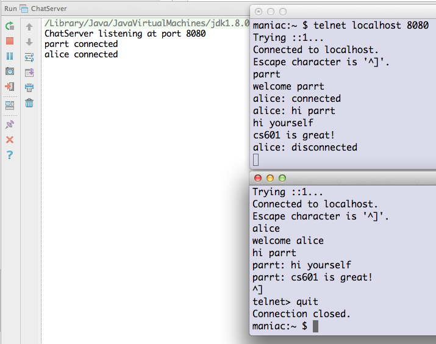

# Chat server lab

*You can pair up with a fellow student to discuss the project and tested out, but try to build the system yourself.*

## Goal

Your goal in this lab is to create a simple chat server that allows multiple clients to connect (via `telnet`). The first line typed by the client is considered their username. Everything they type from then on his broadcast to all connected clients with a prefix of their username. Here is a snapshot that shows how it works:

## Tasks

To make this work we will have to launch client handlers in separate threads, one per client connection. Otherwise, it's very similar to the server you created in the last lab. Here is the sequence of operations:

| `telnet` | `ChatServer` |
|--------|--------|
|        | open server socket, await connection       |
|  open connection       |  create `ChatClientHandler`, launch it in thread, go back to listening for connections      |

| `telnet` | `ChatClientHandler` |
| --- | --- |
| send username as first line   | |
|  |read line, call `registerClient(user,out)` on `ChatServer`, which sends welcome to client, print msg to stdout.|
| | wait for a line of input from the client |
| type first msg line | |
| | call `broadcast(user,line)` on `ChatServer` |
| type msg line | |
| | call `broadcast(user,line)` on `ChatServer` |
| ... | ... |
| client disconnects | |
| | call `disconnect()` |

The client handler reads until `line` is `null`, indicating that the client (`telnet`) has hung up.

I've provided two skeleton classes for you with comments indicating what the code should be.
