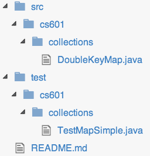

Simple git usage from the command-line
=====

### Cloning a repository

Go to github and locate the repository of interest, such as your first project:

https://github.com/USF-CS601-F14/parrt-doublekey

Then locate the SSH URL on the right-hand gutter of the webpage and click the clipboard icon to get it into your paste buffer:


the URL is actually something like ``git@github.com:USF-CS601-F14/parrt-doublekey.git`` and, to get it onto your local disk, you clone it:


```
$ cd ~/cs601/projects
$ git clone git@github.com:USF-CS601-F14/parrt-doublekey.git
$
```

This makes a ``parrt-doublekey`` directory in the current directory, which in this case is ``~/cs601/projects``. The ``parrt-doublekey`` directory should look like this:



You will also notice a hidden directory that contains all of the stuff needed by git to manage your repository locally:

```
$ ls .git
COMMIT_EDITMSG  ORIG_HEAD       description     info            packed-refs
FETCH_HEAD      branches        hooks           logs            refs
HEAD            config          index           objects
$
```

Technically speaking you never have to think about github ever again as you can continue to commit and modifies repository forever. Github will only ever see changes you push to it, which we will do shortly.

Similarly, if you ever want to throw this copy of the repository out with all the changes you have made, just remove the directory. You don't need to notify anybody. Certainly github does not care if you throw away a clone of its repository.

### Adding files

To add a file, such as your hash table, just create the file and notify ``git``:

```
$ ~/cs601/projects/parrt-doublekey/src/cs601/collections
$ ... created DoubleKeyHashMap.java ...
$ git add DoubleKeyHashMap.java
$
```

To commit the "change" (the addition of a file) to the repository, we ``commit``:

```
$ git commit -a -m 'add start of my hashtable'
[master abd47d9] add start of my hashtable
 1 file changed, 1 insertion(+)
 create mode 100644 src/cs601/collections/DoubleKeyHashMap.java
$
```

The ``-a`` means "all changes" and ``-m`` means message. From ``git help commit``:

<blockquote>by using the -a switch with the commit command to automatically
           "add" changes from all known files (i.e. all files that are already
           listed in the index) and to automatically "rm" files in the index
           that have been removed from the working tree, and then perform the
           actual commit;
</blockquote>

### Changing files

If you want to make a change to one of the files, just do so and do another commit:

```
$ ... alter DoubleKeyHashMap.java ...
$ git commit -a -m 'tweak my hashtable'
[master 7624de2] tweak my hashtable
 1 file changed, 2 insertions(+)
```

### Deleting files

To delete a file, just remove it with the operating system as usual and perform a commit.

```
$ rm Useless.java # assume Useless.java is already in the repository
$ git commit -a -m 'get rid of a useless file'
[master 20bddef] get rid of a useless file
 1 file changed, 0 insertions(+), 0 deletions(-)
 delete mode 100644 src/cs601/collections/Useless.java
$
```

### Push your changes to github

We have been working on a local copy of the repository stored at github. To send our changes from the local copy to github (assuming we used ``clone`` to make the local copy), we use ``push``:

```
$ git push origin master
Counting objects: 8, done.
Delta compression using up to 12 threads.
Compressing objects: 100% (5/5), done.
...
   e5d5910..c764081  master -> master
...
$
```

The ``origin`` refers to github in our case and ``master`` is the name of the branch in which we are working. More on branches shortly.

### Pulling changes from github

If you move to a new computer, or your local copy gets wiped out for some reason, you need to pull from github any changes pushed to it that your local copy does not have. We use ``pull`` for this.

If everything is up to date, you will see the followng:

```
$ git pull origin master
From github.com:USF-CS601-F14/parrt-doublekey
 * branch            master     -> FETCH_HEAD
Already up-to-date.
$
```

Otherwise you will see a message saying that some changes will come down from github to your local copy.

### Branching

```
$
$
```
