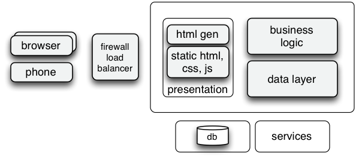
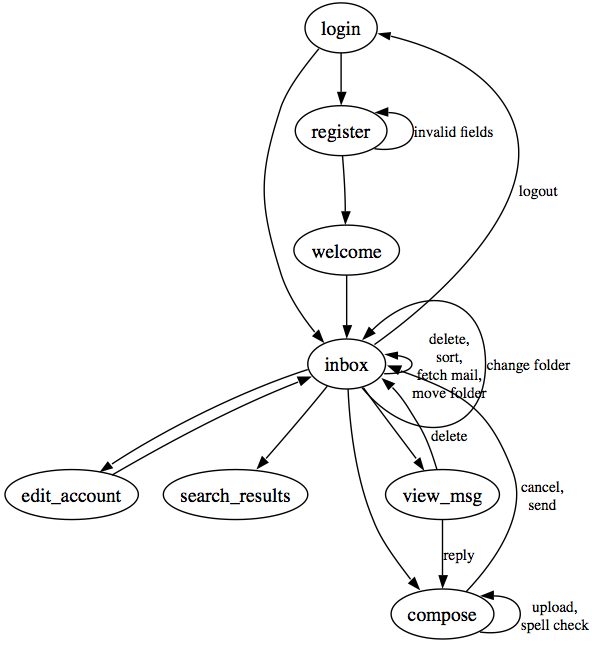

Web Application Architecture
====

Building applications for the web has evolved over the last 20 years from brain-dead cgi-bin applications that executed shell processes with no shared memory between requests all the way up to pure JavaScript *single-page apps*. (From thin to thick client.)

Regardless of the type of presentation layer, HTML or HTML+JavaScript or JavaScript, portions of the architecture remain the same. Where they live is different.



# Webapp Evolution

## Old-school

cgi-bin accepted requests and generated HTML, which was sent back to the browser. After cgi-bin, came php which was executed code on the server as well and emitted HTML back to the browser. As I understand it, php was also stateless; each request required the loading of any state from a database. It did have sessions however.

The generated page is more or less static once it gets to the browser.

Each "screen" of the application is a new URL.

Highly cacheable.

## Enter Java, Web 1.0

Java *applets.*   Didn't really go anywhere but that was what the excitement was all about when Java came out in June 1995. the idea was that the web was no longer static pages but you could send content that would display or manipulate data as well as just data. In the end, they were very clunky, slow to load at the time, and had very little support in terms of libraries.

With Java servlets in the late 90s, a single running process acts as the server and can maintain state between requests. The Java servlets generated HTML which was then sent back to the browser as before.

Any interaction with the user required a new page request to the server.

The generated page is more or less static once it gets to the browser.

CSS started to become popular to alter the look and feel of the generated HTML, but it is not really useful to make wholesale changes to a page structure. Better to alter the DOM or get new page for that.

Each "screen" of the application is a new URL. Any change to a single element requires a refresh of the entire page, leading to lots of wasted bandwidth and slow user experience.

Pages generated with servlets, JSP, template engines (MVC Frameworks).

```html
<html>
<body>
<p>Hi, $name$!</p>
<p>Phones:
<ul>
$phones:{p | <li>$p$</li>}$
</ul>
</body>
</html>
```

Most of page is cacheable.

How can you cache pages where each user can set their own font and other prefs?

### Formal view of page connectivity

You can look at the collection of pages in a website as a graph with the pages representing nodes and http GET, POST methods representing edges. Further, you can see this graph (or network) as a simple finite state machine (FSM).

You could represent graphically the link from page p1 to page p2 as:


Similarly a button on, say page edit_msg, whose enclosing <form> tag target is process_edit might look like:


Pages can perform redirections via HttpServletResponse.redirect(url), which you can represent as:


Your processing pages should always compute and redirect to another page, never leaving the browser pointing to a processing page. Aside from revealing internal details (people seem to love to try random combinations of URL arguments to screw up your site), it allows a browser "REFRESH" to execute that code again and again (for example, purchasing the same airline ticket n times).

The complete forum message edit/view FSM might look like:


Because not all pages are reachable from every other (directly or indirectly), you actually have a collection of subgraphs or FSMs.

Building diagrams for all your processing FSMs is extremely useful design-wise and for documentation purposes. For example, here is a decent start on your web mail project:



## Intermediate stage

The so-called Web 2.0 generation (mid 2000s) started getting more interaction on the client side to avoid so many page transitions. Along with the static HTML, we started sending JavaScript and using libraries such as [jQuery](http://en.wikipedia.org/wiki/JQuery) in order to get client-side scripting and more interactive apps.

With [ajax](http://en.wikipedia.org/wiki/Ajax_(programming)) (Introduced [here](http://www.adaptivepath.com/ideas/ajax-new-approach-web-applications/)), we get event handling done in JavaScript and these events request DATA not HTML from the server. Ajax is basically html + CSS + DOM manipulation + XML data interchange + asynchronous data retrieval for better responsiveness + bound together with JavaScript.

Diagrams from [Jesse James Garrett](http://www.adaptivepath.com/ideas/ajax-new-approach-web-applications/)


The **asynchronous** part is important because the user at least has a page up and data gets loaded in the background; UI elements appear when the data becomes available. Previously we had to wait for the entire page to load from the server before we saw anything. booo!


jQuery is about DOM manipulation. [jQuery tutorials](http://www.w3schools.com/jquery/). Can easily find/alter DOM subtrees/elements.  Let's you attach events to DOM nodes rather than requiring HTML attributes that call JavaScript like `onClick`. [Hide all p elements](http://www.w3schools.com/jquery/tryit.asp?filename=tryjquery_hide_p):

```javascript
<script>
$(document).ready(function(){ // exec after page loads
// Demonstrates the jQuery hide() method, hiding all <p> elements.
$("p").click(function(){
    $(this).hide();
  });
});
```

We can even do drag-and-drop of page elements at this point. Easy to [add stuff](http://www.w3schools.com/jquery/tryit.asp?filename=tryjquery_html_append):

```javascript
$("#btn1").click(function(){
    $("p").append(" <b>Appended text</b>.");
  });
```

```html
<body>
<p>foo</p>
<button id="btn1">Append text</button>
</body>
```

Starts trend towards JSON away from XML data.


The callback-style programming is **pretty complicated** and these pages quickly become a god-awful mess.

[SOAP -- Simple Object Access protocol](http://en.wikipedia.org/wiki/SOAP) used to be a big deal but thankfully has started to go away. It's more or less remote procedure call over HTTP using filthy XML (huge bloat in protocol). I'm not sure, but I don't think many people used it with JavaScript to communicate with a server.

JavaScript starts pulling data via XML (and JSON, mostly XML at this point) rather than HTML pages.

"Screens" of the application can be new URLs or updated pages through the use of JavaScript altering the HTML DOM tree in memory of the browser.

Harder but not impossible to cache things.

## The JavaScript era

### Single-age apps

Load a single page from server that has JavaScript. From then on, data goes back and forth not HTML page fetches. Switches to a *Service-oriented architecture.* Server is mainly a keeper of the model and responds to service requests. View is all on the client side.

It's good to put UI related logic on the client and business logic on server. So instead of doing a business calc on the client, the calc is done on the server and the result is passed to the client.

Good design: The server provides the general formatting of a page as HTML and then on the client side you have a simple `div` that says: "*stick the view here*."

<table>
<tr><td><b>Example</b>. Imagine a webpage for an accounting application where there are different sections of the site for receivables, payables, reports, and so on.  There is a navigation menu across the top of the page.

A <a href="http://en.wikipedia.org/wiki/Single-page_application">single page app</a> (<i>SPA</i>) would have to render the nav menu client side and would have to manage things like the login name, track which sections there are, etc...  As an alternative, the server can render the navigation menu.  As you switch pages, the browser would load up a different SPA (or maybe the same one with different data/state).  This lessens the amount of logic you have to send to the client and possibly makes it easier for something like SEO and search indexing.

The other benefit to multiple mini SPA's is just the separation of functionality.  Now you can have multiple people working on the same code base without really stepping on each other's toes. It is a way of handling the complexity of a large, multi-person project.
</td></tr></table>

[AngularJS](https://angularjs.org/) seems to be a favorite, though it has a very steep learning curve. It is definitely better than the free-form JavaScript+jQuery apps that people were building.

[Bootstrap](http://getbootstrap.com/) is very nice "HTML, CSS, and JS framework for developing responsive, mobile first projects on the web." The same page can look pretty good on a small phone and automatically reorganizes itself. My [parrt website](http://parrt.cs.usfca.edu/) was built using Bootstrap. Try it on your phone and a browser.

[Ember](http://emberjs.com/) comes highly recommended to me as a better approach than angular but also has a steep learning curve.

[ReactJS](http://facebook.github.io/react/). "A JAVASCRIPT LIBRARY FOR BUILDING USER INTERFACES." I like this one.

A big disadvantage is that it's very **hard to web crawl these dynamic applications.** Another is that you **can't really bookmark** or pass along a URL that represents a particular state or location within the application. At least you have to work hard to make that possible. Github does a good job of this. From [SPA on wikipedia](http://en.wikipedia.org/wiki/Single-page_application): <blockquote>The traditional solution for SPA's has been to change the browser URL's hash fragment identifier in accord with the current screen state. This can be achieved with JavaScript, and causes URL history events to be built up within the browser. As long as the SPA is capable of resurrecting the same screen state from information contained within the URL hash, the expected back button behavior is retained.</blockquote>

It's really hard to cache JavaScript stuff as nothing is really going back and forth between the server as HTML anymore.

### WebSockets

[WebSocket](http://en.wikipedia.org/wiki/WebSocket) allows two-way communication between the browser and the server, once the primary HTTP connection hands it off to WebSockets. The server can even do push notifications to the browser this way.  Still uses port 80 though. Sends `Upgrade: websocket` and `Connection: Upgrade` header. Server responds with same. What follows after this http-like handshake is NOT http. Now it's like a regular socket: r/w channel.

Browser / server implementation required.
