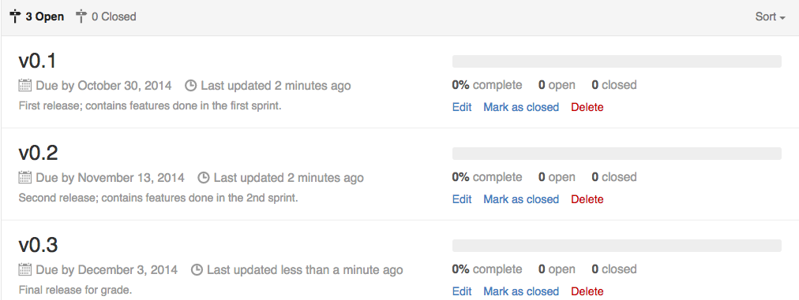
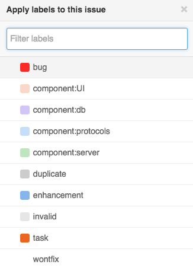
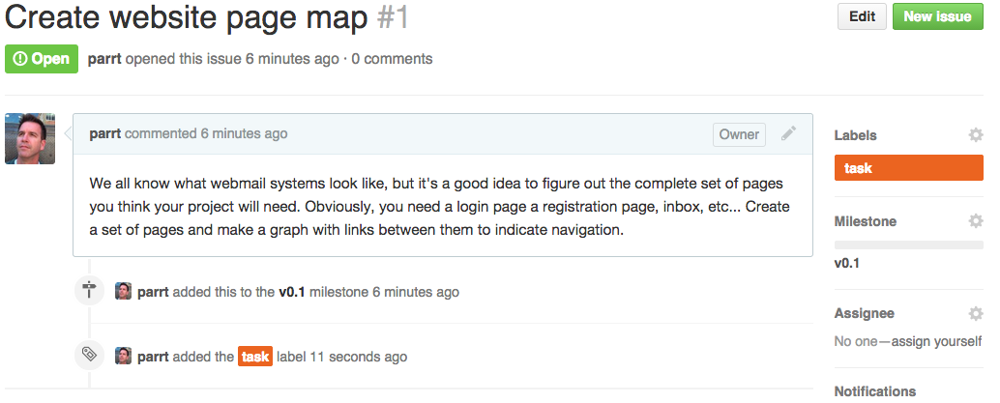

Webmail Project
====

*Final release due December 3, 2014.*

In this project you will build a website that acts as a web-based email client server like gmail or hotmail.   There will be three releases, v0.1-v0.3, with the last one due December 3rd, the last day of class.

To give you an idea what a successful project looks like, here are the videos Jean Bovet made of his project from years ago:

* [filter](movies/webmail/filter.mov)
* [move_delete](movies/webmail/html_move_delete.mov)
* [presentation](movies/webmail/presentation.mov)
* [search](movies/webmail/search.mov)
* [smartfolders](movies/webmail/smartfolders.mov)
* [spellchecker](movies/webmail/spellchecker.mov)

You will make an appointment to demo and do a code review with the instructor at the last release. You will not receive a formal grade for the first two releases, but I will comment on your project to give you an idea of where I think you are and whether you are on track.

The overall project is scored as 100 points, but it is weighted more heavily than the other projects. *It is worth 30% of your overall grade.* Doing well on this project is critical to achieving a good grade in the class. *Some of the features are required to even pass the class.*

# Goals

The goal of this project is to produce something interesting and useful that requires you to combine the following knowledge:

* Java file I/O
* databases
* sockets
* Java Collections (data structures)
* multi-threaded programs
* protocols such as SMTP, POP
* web servers and web page generation
* client-side JavaScript / UI
* HTML
* search engine construction
* statistical pattern matching
* revision control systems (git)
* issue/release management
* UNIX (your server will run on linux)

Most people's projects end up being about 6-7000 lines of code.

# Features

The following is a list of features and the associated points you can acquire while constructing your webmail project. You are free to add additional features, but discuss it with the instructor first to determine its suitability and potential point value.

**You must complete all features marked with an x in the required column in order to pass the entire class.**

|Required| Points | Feature |
|--------|--------|--------|
| x |4 | User registration. You must support multiple users, each with their own POP server to pull mail from and SMTP server to send email out of. Users are stored in the database. Passwords are not stored in the clear in the database.|
| x |3 | User log in/out |
| x |5 | Pull email from POP servers via your own POP protocol handler and display on website. Requires SSL connection to Gmail or similar.|
| x|2 | Mail pulled from POP is stored in the database. |
|x |3 | Obviously, you must have an `Inbox` folder/tag where incoming mail is displayed. |
|x|3 | View mail message page. |
|x|3 | Have a functional "check mail" button. |
|x|3| A compose message page. |
|x |4 | Send/reply to email using your own SMTP client. Use `smtp.usfca.edu` as the outgoing mail server.  You can also set it up to use SSL to connect to gmail's or any other if you want. |
| x|3 | Forward email feature.|
|x|3 | User is able to delete mail (sends to hardcoded or user-defined `Trash` folder/tag and then have a "empty trash button"). |
|x|2| Support HTTPS connections to your website not just HTTP.|
| |3 | An indication for messages and message lists (mailboxes) whether a message has been read or not. An ability to toggle read/unread.|
| |3| Mailbox view pagination so user can select page of multipage view. |
| |2 | Sent mail goes to hardcoded or user-defined `Sent` folder/tag. |
| |2 | Edit user account to change password etc... |
| |5 | Support user-defined "folders" or "tags" so users can direct incoming email to various folders manually. Users can move mail between folders by changing tags.|
| |3 | Support viewing of in-line email images. |
| |3 | User is able to search all of their mail for keywords; use a simple linear walk of the data via the database or FOR loop (rather than a sophisticed search engine like Lucene). The user should be able to pick the field such as "from" or "subject" to search in. |
| |5 | Use of Lucene to search through email. The user should be able to pick the field such as "from" or "subject" to search in.|
| |3 | Sort mail folder display by various fields/columns such as sender's email, subject, ... |
| |5 | Support attachments (send/receive) |
| |3 | Spell checking that highlights words not found in a large dictionary when the user clicks a button on the compose message page; or, more sophisticated functionality. |
| |5 | A contact list feature that allows users to add, delete, and view contacts. It should also allow selection or auto completion or some other mechanism to make it easy to email those contacts.|
| |5 | SPAM filtering using something like a Naive Bayes classifier. You can use a library for this feature; i.e., don't build your own classifier.  User should be able to identify which messages are spam and which are not.|

In addition, your project will be evaluated on the following more subjective features:

| Points | Feature|
|--------|--------|
| 5 | Code quality as measured by instructor.|
| 5 | Overall aesthetic and design quality of the website.|
| 5 | Overall management of the project, including your prioritization of features and task completion. Includes how well you use git and github mechanisms such as releases, issues, and git commits etc...|

Notice that these subjective scores cover 15% of the project. Screwing these up means the most you can achieve is 85% on the entire project.

# Requirements

You must do your project in Java and use the Jetty server as an embedded server. If you want to use a search engine, you must use Lucene.

You are required to build functionality and design documents via github's wiki to complement your project.

You must demonstrate your server running via a Linux server posted at https://www.digitalocean.com. You can get a free account as a student. You must learn to deploy software on a Linux machine. In our case it's fairly easy because you can bundle jetty, your software, and any other libraries like Lucene as a single jar and ship it to the remote server. You must run the server as a root and have it at Port 80.

**Final submission of your project requires that you send instructor the public URL of your website.**

I have provided a [basic github repository](https://github.com/parrt/cs601-webmail-skeleton) that you can look at to learn more about using that website.

## Project management

### Releases

[Releases](https://github.com/parrt/cs601-webmail-skeleton/releases). For each milestone, you will do a release, which involves creating a tag in git and then creating a release on github itself associated with that tag. Anytime you want, you can go back to that release by checking out that tag in git.

v0.1, ...:
https://github.com/parrt/cs601-webmail-skeleton/milestones

### Tracking progress

https://guides.github.com/features/issues/

[Issue to create a map of your website pages](https://github.com/parrt/cs601-webmail-skeleton/issues/1). You will also note that I've attached it to the [first milestone](https://github.com/parrt/cs601-webmail-skeleton/milestones/v0.1).

# Grading

**The authors of the best 2 projects in the class will be excused from exam II.**

**You must complete the required level to pass the entire class.**

The evaluation of "quality" is necessarily a subjective measure, but I will do my best to quantify what I'm looking for and rate you all according to the same measure.  Each feature will be rated at each release (if it is complete).

*By definition, there is no late project*--your last working release will be considered in lieu of any unfinished project.  Missing a release in order is not acceptable.

The instructor will review your work for 10 or 15 minutes at each release.
